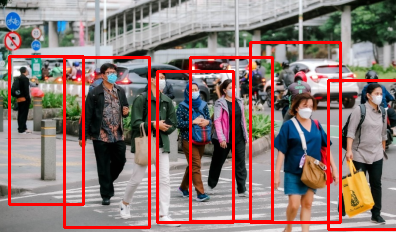

# 🚶 Pedestrian Detection using HOG + SVM

Proyek ini mengimplementasikan **deteksi pejalan kaki** secara otomatis menggunakan metode **HOG (Histogram of Oriented Gradients)** dikombinasikan dengan **SVM (Support Vector Machine)** bawaan OpenCV. Program dapat memproses baik **gambar statis** maupun **video**.

---

## 📸 Demo

### Input Gambar


> Pejalan kaki terdeteksi dan ditandai dengan kotak merah pada gambar/video keluaran.

---

## 📁 Struktur Proyek

```
pedestrian-detection/
│
├── img.png               # Gambar sampel untuk deteksi
├── vid.mp4               # Video sampel untuk deteksi
├── detect_image.py       # Script deteksi pada gambar
├── detect_video.py       # Script deteksi pada video
└── README.md
```

---

## ⚙️ Persyaratan

Pastikan Python sudah terinstall, lalu install dependensi berikut:

```bash
pip install opencv-python imutils
```

| Library        | Fungsi                                      |
|----------------|---------------------------------------------|
| `opencv-python`| Pemrosesan gambar & video, HOG descriptor   |
| `imutils`      | Utilitas resize gambar agar lebih mudah     |

---

## 🚀 Cara Penggunaan

### 1. Deteksi pada Gambar

```bash
python detect_image.py
```

Script ini akan:
- Membaca file `img.png`
- Me-resize gambar ke lebar maksimal 400px
- Mendeteksi pejalan kaki menggunakan HOG detector
- Menampilkan gambar dengan kotak merah di sekeliling pejalan kaki yang terdeteksi

```python
import cv2
import imutils

hog = cv2.HOGDescriptor()
hog.setSVMDetector(cv2.HOGDescriptor_getDefaultPeopleDetector())

image = cv2.imread('img.png')
image = imutils.resize(image, width=min(400, image.shape[1]))

(regions, _) = hog.detectMultiScale(image, winStride=(4, 4), padding=(4, 4), scale=1.05)

for (x, y, w, h) in regions:
    cv2.rectangle(image, (x, y), (x + w, y + h), (0, 0, 255), 2)

cv2.imshow("Image", image)
cv2.waitKey(0)
cv2.destroyAllWindows()
```

### 2. Deteksi pada Video

```bash
python detect_video.py
```

Script ini akan:
- Membaca file `vid.mp4` frame per frame
- Me-resize setiap frame ke lebar maksimal 400px
- Mendeteksi pejalan kaki secara real-time di setiap frame
- Menampilkan video dengan kotak merah pada pejalan kaki yang terdeteksi
- Tekan **`q`** untuk menghentikan pemutaran video

```python
import cv2
import imutils

hog = cv2.HOGDescriptor()
hog.setSVMDetector(cv2.HOGDescriptor_getDefaultPeopleDetector())

cap = cv2.VideoCapture('vid.mp4')

while cap.isOpened():
    ret, image = cap.read()
    if ret:
        image = imutils.resize(image, width=min(400, image.shape[1]))
        (regions, _) = hog.detectMultiScale(image, winStride=(4, 4), padding=(4, 4), scale=1.05)
        for (x, y, w, h) in regions:
            cv2.rectangle(image, (x, y), (x + w, y + h), (0, 0, 255), 2)
        cv2.imshow("Image", image)
        if cv2.waitKey(25) & 0xFF == ord('q'):
            break
    else:
        break

cap.release()
cv2.destroyAllWindows()
```

---

## 🧠 Cara Kerja

```
Input (Gambar/Video)
        ↓
  Resize Gambar (max 400px lebar)
        ↓
  HOG Feature Extraction
  (Menghitung gradien tiap blok piksel)
        ↓
  SVM Classifier
  (Klasifikasi: pejalan kaki / bukan)
        ↓
  Bounding Box (kotak merah)
        ↓
  Output Ditampilkan
```

### Parameter Deteksi

| Parameter    | Nilai  | Keterangan                                             |
|--------------|--------|--------------------------------------------------------|
| `winStride`  | (4, 4) | Langkah geser sliding window (lebih kecil = lebih teliti) |
| `padding`    | (4, 4) | Padding di sekitar window deteksi                      |
| `scale`      | 1.05   | Faktor skala image pyramid (lebih kecil = lebih akurat) |

---

## 📌 Catatan

- Deteksi HOG bawaan OpenCV dioptimalkan untuk **pejalan kaki yang berdiri tegak**.
- Performa terbaik pada gambar/video dengan pencahayaan yang cukup.
- Semakin kecil nilai `winStride` dan `scale`, semakin akurat namun semakin lambat prosesnya.

---

## 📚 Referensi

- [OpenCV HOG People Detector](https://docs.opencv.org/4.x/d5/d33/structcv_1_1HOGDescriptor.html)
- Dalal, N., & Triggs, B. (2005). *Histograms of Oriented Gradients for Human Detection*. CVPR.
